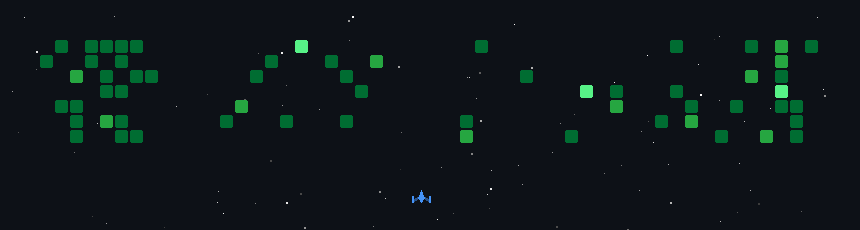

<!---
Joshua-Ludolf/Joshua-Ludolf is a ✨ special ✨ repository because its `README.md` (this file) appears on your GitHub profile.
You can click the Preview link to take a look at your changes.
--->

  

  

---

## 👋 Hi there! I'm Joshua Ludolf

Hi, I'm Joshua Ludolf, an aspiring software developer/artificial intelligence professional. I have a strong foundation in various technologies and am always eager to learn and explore new innovations. In my free time, I enjoy working on personal projects, contributing to open-source, and staying updated with the latest trends in technology.

---

## 🚀 Skills & Technologies

- **Languages:**  
  
  
  
  
  
  

- **Frameworks:**  
  
  
  

- **Tools:**  
  
  
  
  
  
  

- **Databases:**  
  
  
  `etc.`

- **Cloud:**  
  
  

---

## 👤 About Me

- 🔭 Currently working on: personal projects & open source contributions  
- 🌱 Currently learning: `Python`, `Machine Learning`  
- 💬 Ask me about: backend development, graph databases, open source  
- ⚡ Fun fact: My favorite color is turquoise  
- 🎵 Hobbies: Playing videogames, watching movies, and exploring new tech

---

## 📌 Pinned Projects

- [FSA Benchmark Reproduction Research](https://github.com/Joshua-Ludolf/FSA-benchmarking-Reproduction-Research): This project aims to explore and benchmark various machine learning models for detecting disks at high risk of experiencing fail-slow anomalies.
- [Promising Products](https://github.com/Joshua-Ludolf/Promising-Products): This project aims to provide solutions to common problems faced by customers using Frontier Internet's products.

---

<h2 align="center">📫 Let's Connect!</h2> 

  
  

  
## Programming Quotes 🧠

## Snake Game 🐍
<picture>
  <source media="(prefers-color-scheme: dark)" srcset="https://raw.githubusercontent.com/Joshua-Ludolf/Joshua-Ludolf/output/github-contribution-grid-snake-dark.svg">
  <source media="(prefers-color-scheme: light)" srcset="https://raw.githubusercontent.com/Joshua-Ludolf/Joshua-Ludolf/output/github-contribution-grid-snake.svg">
  
</picture>

## Space Invaders Game 👾

